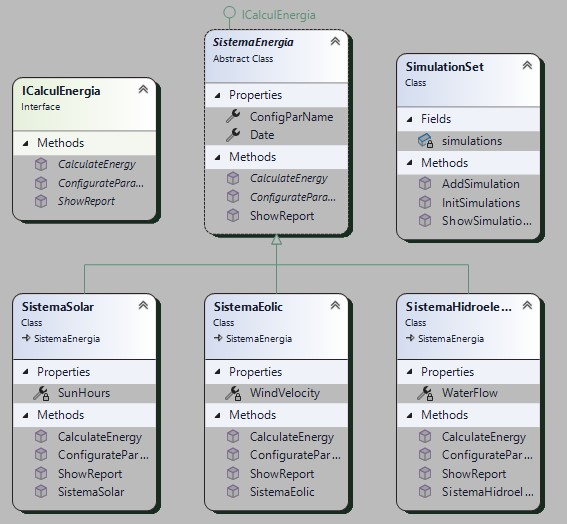

# T3-PR1-EcoEnergy-Solutions

### Arnau Pascual

Practice Statment -> [T3. PR1. Pràctica 1](https://docs.google.com/document/d/1bN0BW-bYcF3e6OlEpskeBdttGlS6fIVUBbqIXBqyyhY/edit?usp=sharing)

## Diagrams

### Class Diagram

### Use Case Diagram

## SonarQube

**SonarQube Cloud Images of the quality comprovation code**:

## Bibliografia

### Web Pages

> Sense Autor. (Sense data). Complete List of Exception Class in C#. Complete C# Tutorial. Recuperat el 26/1/2025 de https://www.completecsharptutorial.com/basic/complete-system-exception.php.

> Sense Autor. (Sense data). DateTime.Now Property. Microsoft. Recuperat el 27/1/2025 de https://learn.microsoft.com/es-es/dotnet/api/system.datetime.now?view=net-9.0.

> Manuel Dávila. (12/6/2023). Introducción a xUnit: Una poderosa herramienta para Unit Testing en .NET. Dev. Recuperat el dia 3/12/2024 de https://dev.to/maadcode/introduccion-a-xunit-una-poderosa-herramienta-para-unit-testing-en-net-34b0.

### AI Questions

> **Com puc fer una taula per consola?**
>
> Interpolació de cadenes:
>
> Console.WriteLine($"{"Nom",-20} | {"Edat",-10} | {"Ciutat",-15}");
>
> Console.WriteLine(new string('-', 50));
>
> Console.WriteLine($"{"Joan",-20} | {25,-10} | {"Barcelona",-15}");

> **Amb Interpolació de cadenes com puc fer per a que hi hagi espai a davant del text i a darrera?**
>
> string text = "Hola";
>
>  Console.WriteLine($"{{text,10}}"); // Afegeix espais a l'esquerra
>
> Console.WriteLine($"{{text,-10}}"); // Afegeix espais a la dreta
>
> Console.WriteLine($"{{text,10}}{{text,-10}}"); // Espais a ambdós costats

> **Que es gettype()**
>
> GetType() és un mètode en C# que s'utilitza per obtenir el tipus de l'instància actual d'un objecte en temps d'execució. Aquest mètode retorna una instància de la classe Type, que representa informació sobre el tipus de l'objecte.
